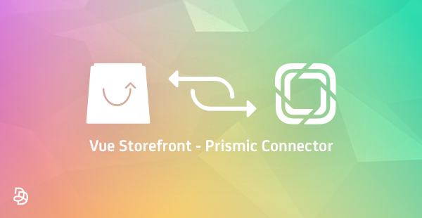

# Vue Storefront - Prismic Connector:

Vue Storefront - Prismic Connector is a [Vue Storefront](https://github.com/DivanteLtd/vue-storefront) extension that allows you to display CMS blocks and pages contents from the headless CMS Prismic.

Official extension page on the Vue Storefront forum: [Vue Storefront - Prismic Connector](https://forum.vuestorefront.io/t/prismic-connector/160)

### Documentation:

Vue Storefront - Prismic Connector complete documentation is available [here](doc/summary.md).

### How it works:

With Vue Storefront - Prismic Connector, you can:
* Display CMS blocks from Prismic
* Display CMS pages from Prismic
* Automatically access the CMS pages from a slug defined in Prismic

### Requirements:

* Vue Storefront API - Prismic Connector needs to be setup on your Vue Storefront API instance: [Vue Storefront API - Prismic Connector](https://github.com/Agence-DnD/vue-storefront-api-prismic-connector) 

### About us:

Founded by lovers of innovation and design, [Agence Dn'D](https://www.dnd.fr) assists companies in the creation and development of customized digital (open source) solutions for web and E-commerce since 2004.
